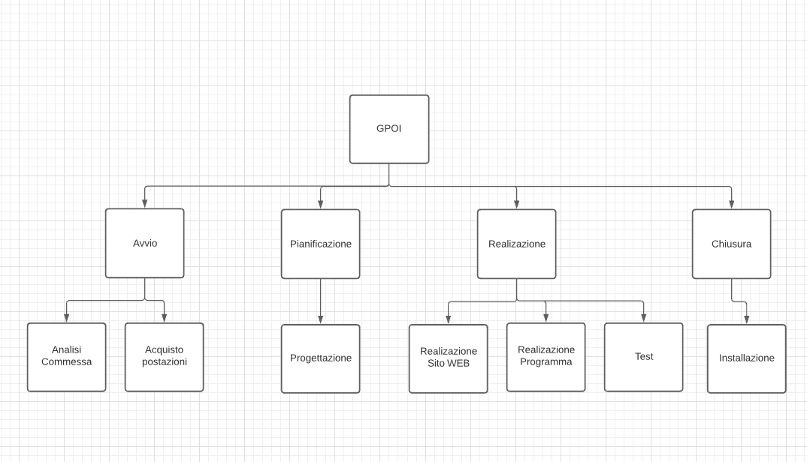

# WBS
## WBS per il progetto progettoGPOI per lo sviluppo del turismo nella città di Gallipoli

| Progetto: WBS GPOI | Codice progetto: A001 |
| :----: | :----: |
| Data: 05/04/2021  | Revisione: 0 |
| Cliente: Turisti di Gallipoli | Sponsor: Agenzia Del Turismo  |

## **WBS**- **Descrizione**- **Durata**
  * **1.1 Avvio**
     * 1.1.1 Analisi Comessa  1
     * 1.1.2 Acquisto Postazioni  4
  * **1.2 Pianificazione** 
    * 1.2.1 Progettazione  15
  * **1.3 Realizazione**
    * 1.3.1 Realizazione sito WEB 10
    * 1.3.2 Realizazione Programma 10
    * 1.3.3 Test 5
  * **1.4 Chiusura**
    * 1.4.1  Installazione 2

