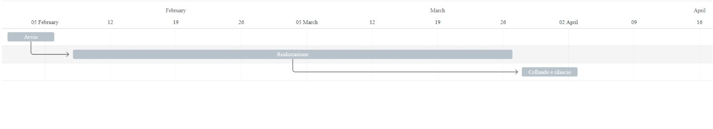

# Project Charter
## Project charter per il progetto progettoGPOI per lo sviluppo del turismo nella città di Gallipoli

| Progetto: progettoGPOI | Codice progetto: A001 |
| :----: | :----: |
| Data: 17/03/2021  | Revisione: 0 |
| Cliente: Turisti di Gallipoli | Sponsor: Agenzia Del Turismo  |

## 1. Obbiettivi
Visto che turismo in tutta Italia ha subito una forte crisi economica e numerica dovuta alla pandemia di COVID-19, siamo stati incaricati dall'Agenzia Del Turismo per realizazzione e promozione di un software in grado di aumentare il numero dei turisti. In particolare creeremo un software per la città di Gallipoli.

## 2. Principali deliverables
**Projet Menagement:** Pianificazione 
**Progettazione:** Analisi & Specifiche 
**Progettazione:** Interfacia Utente 
**Esecuzione:** Programma app 
**Esecuzione:** Programma e installazione app 

## 3. Milestones
* Progettazione software
* programma applicativo
* Programma di installazione

## 4. Vincoli e dipendenze
**Le risorse necessarie esterne all'azienda sono:**
* Fotografo professionista
* Guida turistica del luogo
* Organizzatore di eventi

## 5. Tempistica preliminare

## 6. Principali risorse e limiti di costo
   il baget per la realizazione è 15.000€
   * Projet Maneger 95€/h
   * Postazioni 990€ (a postazione)
      * Computer 
      * Software 
   * Personale Esterno
       * Fotografo 35€/h
       * Guida Turistica 30€/h
       * Organizatore di eventi 50€/h
   

## 7. Documenti di riferimento e allegati
Documenti momentaneamente mancanti

## 8. Struttura organizzativa
**Project manager:** 
* Chellini Duccio
* Chiaramonti Alessio 

**Team del progetto:**
   * Alessio Chiaramonti
   * Chellini Duccio
   * Programmatori
   * Fotografo
   * Guida Turistica
   * Organizatore di eventi
## 9. Autorizzazioni
<table>
  <tbody>
    <tr>
      <th>Approvato da:</th>
      <th> Data: </th>  
    </tr>
         <tr>
          <td>Prof Lunghi e prof Pardini</td>
          <td>25/03/2021</td>
    </tr>
    
    
   </table>

 
